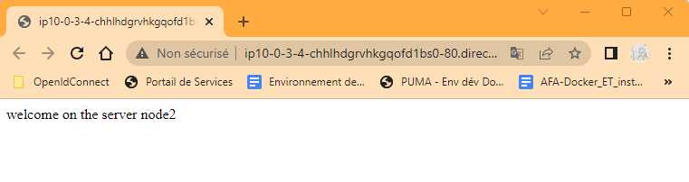
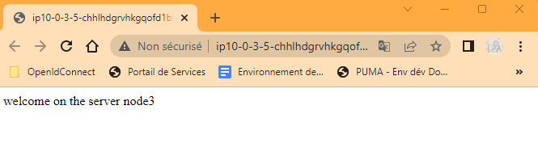

# ansible-loop-conditions-templates

In  this hands-on lab, we explain the concepts of loops, conditions, and templates in Ansible.

We notice that we can do it on the play-with-docker plateform but  

We are going to based on the project located at this github link : “https://github.com/a-farsi/example-ansible-playbook/tree/main”, while using the Eazytrining docker-like plateforme. 

I'd like to mention that we can realize this hands-on lab on the Play-With-Docker "https://labs.play-with-docker.com/. However, we need first to install Ansible on an instance to play the role of a managed node. A simple post to use ansible on play-with-docker plateform will be posted later.

## Loops and conditions

We are modifying the playbook file 'deploy.yml' to install the following three applications using yum: git, wget, and epel-release.

The installation of 'git' and 'wget' should only occur if the Linux distribution is CentOS. This constraints shoule be respected on the Eazytraining plateform. 

The playbook file will be as follows : 

```
---
- name: "Appache installation using docker"
  hosts: prod
  become: true
  vars:
    ansible_sudo_pass: admin
  pre_tasks:
    - name: Install EPEL repo, wget and git
      package: 
        name="{{ item }}" 
        state=present
      when: ansible_distribution == "CentOS"
      loop:
        - epel-release
        - wget
        - git

    – name: download pip script
      get_url:
        url: https://bootstrap.pypa.io/pip/2.7/get-pip.py
        dest: /tmp/get-pip.py
    - name: Install Python-pip
      command: python2.7 /tmp/get-pip.py
    - name: Install docker Python
      pip: name=docker-py
  tasks:
    - name: create appache container
      docker_container:
        name: webapp
        image: httpd
        ports:
          - "80:80"
```

## Templates
The final structure of the project should be as follows : 
```
webapp
├── ansible.cfg
├── templates
│   └── index.html.j2
├── group_vars
│   └── hosts.yml
└── deploy.yml
```

So, within our working directory we create a folder called 'templates' that will contain a template file in Jinja2 format called "index.html.j2", where its content is illustrated below: 

``` 
“Welcome on the {{ansible_hostname}}”. 
```

Our goal is to change dynamically the variable "host_name" in function of the managed node on which the dockerized appache in executed.

To achieve this need, we modify the deployment of the apache container in such away that  : 
- The template ‘index.html.j2’ replace the variable dynamically in function of the target environment while we copy it in /home/admin  under the name 'index.html' by using the template module.
- The template file renamed 'index.html' must be executed by default by apache.

To summarize, we have to render the specified template and replace the existing default apache landing page located at /usr/local/apache2/htdocs/index.html

This is the code of the task that copy a tempmlate on the managed node 

    - name: Copy the template file
      template: 
        src=index.html.j2 
        dest=/home/admin/

However the seconde goal can be achieved by mounting the docker volume. In other words, it is binding the file index.html from the host machine's /home/admin directory to the corresponding location in the target machine's filesystem, specifically under the Apache HTTP server's document root directory (/usr/local/apache2/htdocs/).
This snippet code has to be added at the end of the task "_create appache container_" : 

```
volumes:
          - /home/admin/index.html:/usr/local/apache2/htdocs/index.html
```

The final playbook file looks like this : 

```
---
- name: "Appache installation using docker"
  hosts: prod
  become: true
  vars:
    ansible_sudo_pass: admin
  pre_tasks:
    - name: Install EPEL repo, wget and git
      package: 
        name="{{ item }}" 
        state=present
      when: ansible_distribution == "CentOS"
      loop:
        - epel-release
        - wget
        - git

    – name: download pip script
      get_url:
        url: https://bootstrap.pypa.io/pip/3.6/get-pip.py
        dest: /tmp/get-pip.py
    
    - name: Install Python-pip
      command: python3.6 /tmp/get-pip.py
    
    - name: Install docker Python
      pip: name=docker-py
  tasks:
    - name: Copy website file template
      template:
        src: index.html.j2
        dest: /home/admin/index.html

    - name: create appache container
      docker_container:
        name: webapp
        image: httpd
        ports:
          - "80:80"
      volumes:
          - /home/admin/index.html:/usr/local/apache2/htdocs/index.html
```

When executing the following command : 
```
ansible-playbook -i hosts deploy.yml
```

This figure shows the output that ensures that all pretasks and tasks are well executed.

<p align=center>

</p>
<p align=center>output when executing the ansible-plaubook command</p>


To check that our dockerize apache has been deployed correctely and that is running, we launch a web browser while specifying  the port 80 as defined in the playbook above. we tested on 2 managed nodes, and we see that the variable '_ansible_hostname_' is replaed by the righ host name.

<p align=center>

</p>
<p align=center>The greeting message defines in the template that display the node1's hostname</p>


<p align=center>

</p>
<p align=center>The greeting message defines in the template that display the node2's hostname</p>

